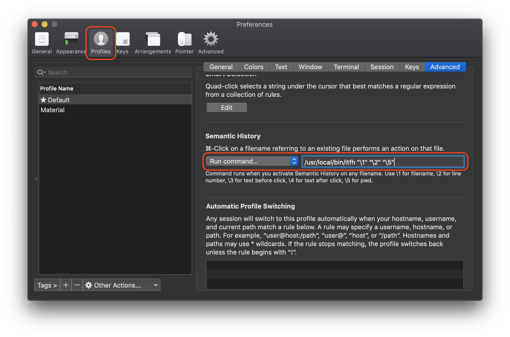

# Iterm File Handler

## Install

1. From source by clonning and running below command
    `python3 setup.py install`
2. Install using pip
    `pip install iterm_file_handler`
3. From git
    `pip install git+https://github.com/pr4bh4sh/iterm-file-handler`

## Uses

1. Add `/usr/local/bin/itfh "\1" "\2" "\5"` in iterm setting as below

2. CMD + Click on the file path displayed in iterm

3. Profit

## Debugging

Add 'test' in the input as `/usr/local/bin/itfh "\1" "\2" "\5" 'test'` to generate logs at `~/.iterm_file_handler.log`. By default it will log if something goes wrong.

### Credits
- https://github.com/jgehrcke/python-cmdline-bootstrap 
- https://github.com/fmeeuw/Iterm2-intellij
